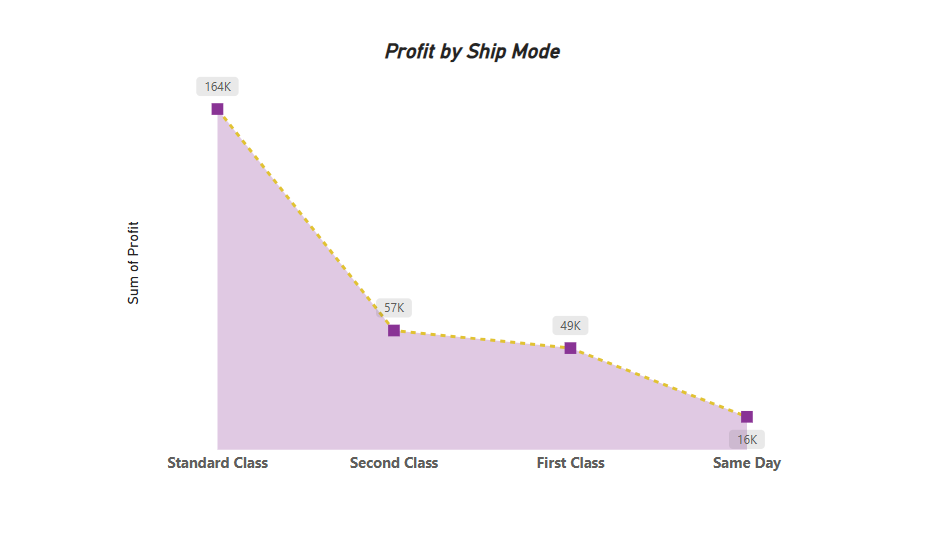
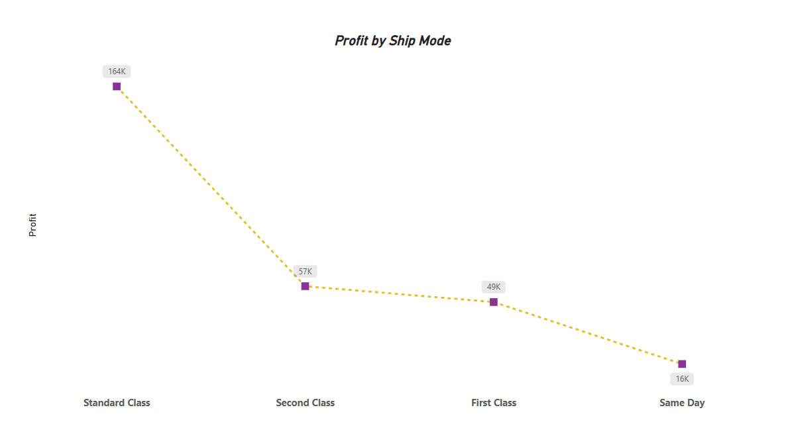
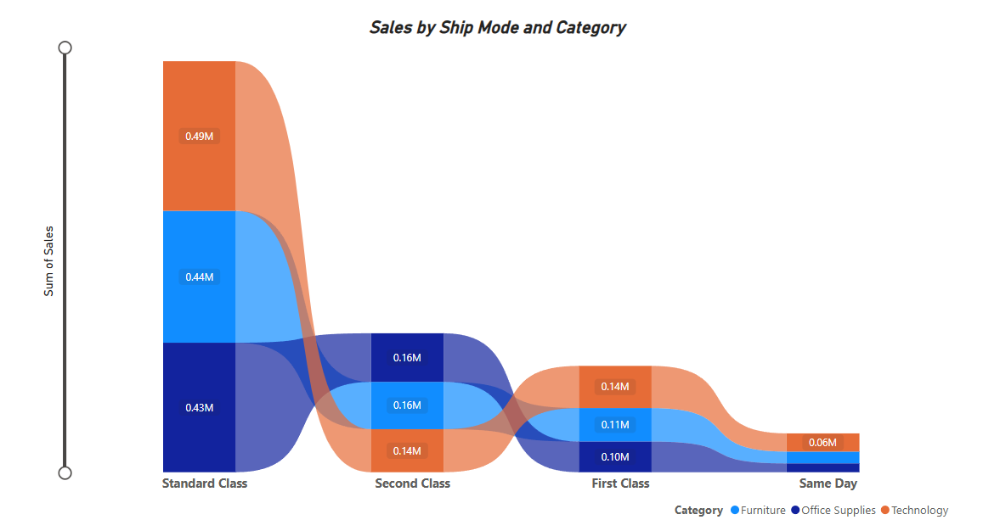
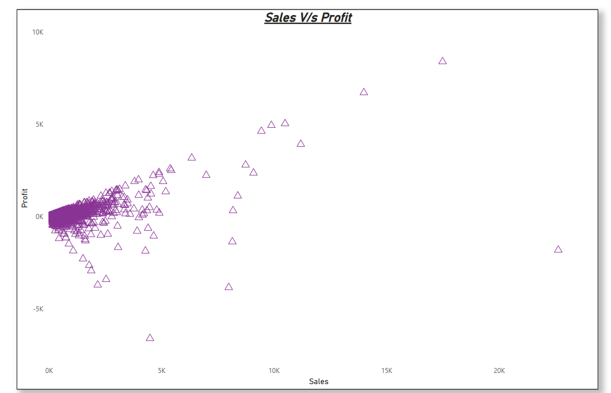

# 📘 Power BI Chart Practice – Visuals with Description and Examples

A visual revision notebook for understanding when and how to use Power BI visuals, with actual examples from practice.

---

### 📁 My Practice Project (.pbix)  
**📝 Description:**  
Contains all Power BI visualizations, datasets, measures, bookmarks, and layout settings.

**🧠 Use When:**  
- Loading full dashboard for demo or revision.  
- Reference for editing or exporting visual images.

🗂 **Filename:** `My practice project.pbix`

---

### 📊 Area Chart  
**📝 Description:**  
Used to represent quantitative data over time. Stacked area charts show part-to-whole relationships.  

**🧠 Use When:**  
- Showing trends over time.  
- Demonstrating volume or cumulative data.  

---

### 📊 Bar Chart  
**📝 Description:**  
Displays data with rectangular bars. Ideal for comparing values across categories.

**🧠 Use When:**  
- Comparing values horizontally.  
- Dealing with long category labels.  

---

### 📊 Clustered Bar Chart  
**📝 Description:**  
Groups bars by category, showing subcategories side by side.  

**🧠 Use When:**  
- Comparing multiple subcategories per main category.  

---

### 📊 Clustered Column Chart  
**📝 Description:**  
Vertical version of clustered bar. Emphasizes category over subcategory.

**🧠 Use When:**  
- Grouped comparisons with vertical emphasis.  

---

### 📊 Column Chart with Legend  
**📝 Description:**  
Includes a legend to distinguish series values (e.g., by region, product type).

**🧠 Use When:**  
- Charting multiple data series with different colors.  

---

### 📊 Column Chart – Small Multiples  
**📝 Description:**  
Visual split into small panels based on category fields.

**🧠 Use When:**  
- Viewing patterns or trends across multiple groups.

---

### 🌳 Decomposition Tree  
**📝 Description:**  
AI-powered visual for drilling down into data and understanding root causes.  

**🧠 Use When:**  
- You want to explore contributing factors behind a value.

---

### 📉 Funnel Chart  
**📝 Description:**  
Represents stages in a process (like a sales funnel).  

**🧠 Use When:**  
- Showing reduction across sequential stages.  

---

### ⏱ Gauge Chart  
**📝 Description:**  
Shows progress toward a goal with a needle indicator.  

**🧠 Use When:**  
- Tracking performance against target.  

📌 **Formulas used:**  
Minimum Value = 0.1 * SUM(Sheet1[Sales])  
Target Value = 0.15 * SUM(Sheet1[Sales])  
Maximum Value = 0.25 * SUM(Sheet1[Sales])

### 🧠 Key Influencers Visual  
**📝 Description:**  
AI-powered visual that analyzes your data to find key drivers for a selected metric.

**🧠 Use When:**  
- You want automatic insight generation.  
- Need to identify what affects a value the most (e.g., why profit is high).  

---

### 🎯 KPI Visual  
**📝 Description:**  
Summarizes key metrics at a glance (like sales or target completion), with indicators for trend or status.

**🧠 Use When:**  
- You want a dashboard-friendly metric summary.  
- Comparing actual vs target performance.  

---

### 🔄 Line and Cluster Column Combo  
**📝 Description:**  
Combines a line chart and a clustered column chart in one view.

**🧠 Use When:**  
- You want to compare a trend (line) against categorical values (columns).  
- Useful for comparing quantity vs average.

---

### 🔄 Line and Stacked Column Combo  
**📝 Description:**  
Line and stacked column chart together—helps visualize total value and its components over time.

**🧠 Use When:**  
- Analyzing both the total and its breakdown.  
- Seeing proportions and trend in a single view.

---

### 📈 Line Chart  
**📝 Description:**  
Classic time-series chart showing continuous data trends using connected lines.

**🧠 Use When:**  
- Visualizing changes over time.  
- Identifying upward or downward trends.

---

### 🧾 Matrix  
**📝 Description:**  
Table-like visual with capabilities for grouping, sorting, drilldown, and total/subtotal aggregation.

**🧠 Use When:**  
- You need a pivot-style table report.  
- Hierarchical or dimensional data comparison.

---

### 🥧 Pie and Donut Charts  
**📝 Description:**  
Circular charts dividing data into slices. Donut chart has space in the middle for labels or icons.

**🧠 Use When:**  
- Showing percentage distribution of categories.  
- Good for simple, small-category visuals.

---

### 💬 Q&A Visual  
**📝 Description:**  
A smart visual that generates charts based on natural language queries entered by users.

**🧠 Use When:**  
- Allowing users to explore data intuitively.  
- Demonstrating Power BI's AI capabilities.

---

### 🎗 Ribbon Chart  
**📝 Description:**  
A dynamic visual to compare category rankings over time, using colored ribbons for flow tracking.

**🧠 Use When:**  
- Showing rank changes between periods.  
- Comparing performance trends across dimensions.

---

### 🔍 Ribbon Chart (Zoomed)  
**📝 Description:**  
Zoomed version of Ribbon chart focusing on specific ranks or categories for better readability.

**🧠 Use When:**  
- Zooming into one time range or category.  
- Emphasizing key movements.

---

### 🔘 Scatter Chart  
**📝 Description:**  
Plots individual data points on X and Y axes to show correlation, clusters, or outliers.

**🧠 Use When:**  
- Analyzing correlation (e.g., Sales vs Profit).  
- Spotting outliers or dense areas.

---

### 🔘 Scatter Chart with Play Axis  
**📝 Description:**  
Same as scatter chart, but includes animation over a time dimension (e.g., years, quarters).

**🧠 Use When:**  
- Animating changes over time.  
- Showing movement or transitions in data.

---
